## Проект UI автотестов hh.ru

<!-- Технологии -->

### Используемые технологии

  <code></code>
  <code></code>
  <code></code>
  <code></code>
  <code></code>
  <code></code>
  <code></code>
  <code></code>
  <code></code>
  <code></code>
  <code></code>

<!-- Тест кейсы -->

### Что проверяем
* Добавление вакансий в Избранные и Черный список
* Вход и Выход из аккаунта
* Поиск профессии с параметрами
* Вход в аккаунт с помощью пароля
* Подписка на рассылку на почту

<!-- Jenkins -->

###  Запуск проекта в Jenkins

### [Job](https://jenkins.autotests.cloud/job/003_python-edbeg1337-head-hunter-pip/)

##### При нажатии на "Собрать с параметрами" откроеться окно где надо выбрать тесты которые запустяться через виртуальную машину в Selenide.
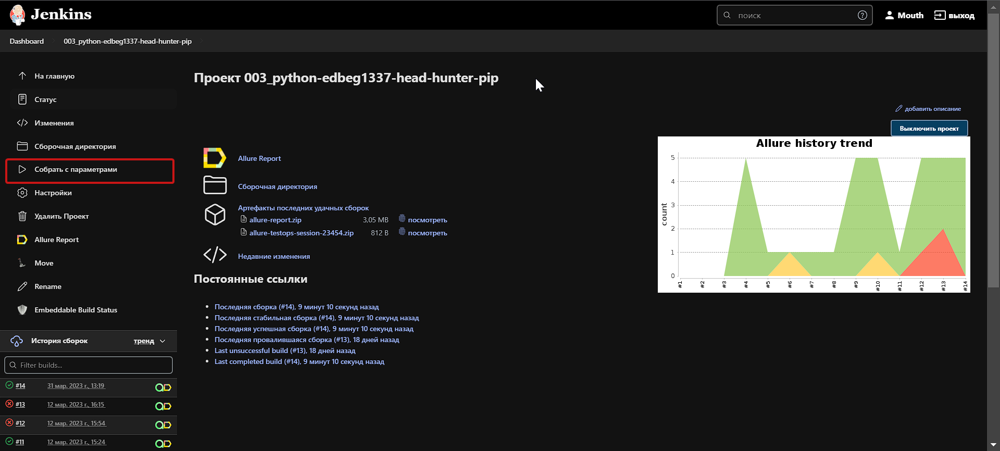
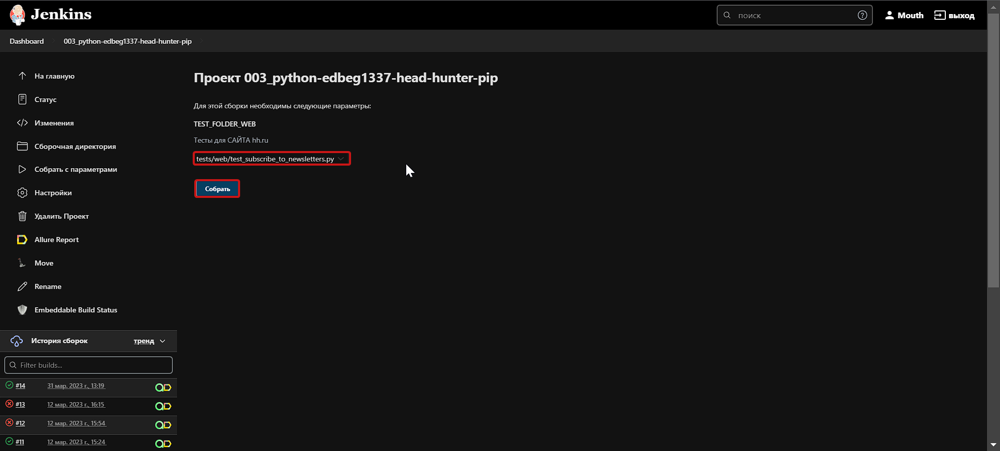
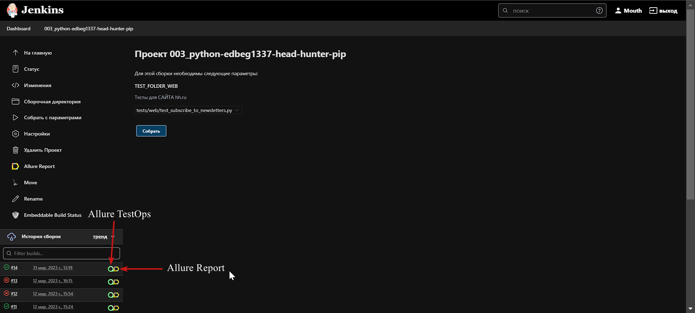

<!-- Allure report -->

###  Allure report

##### После прохождения тестов, результаты можно посмотреть в Allure отчете, где так же содержится ссылка на Jenkins
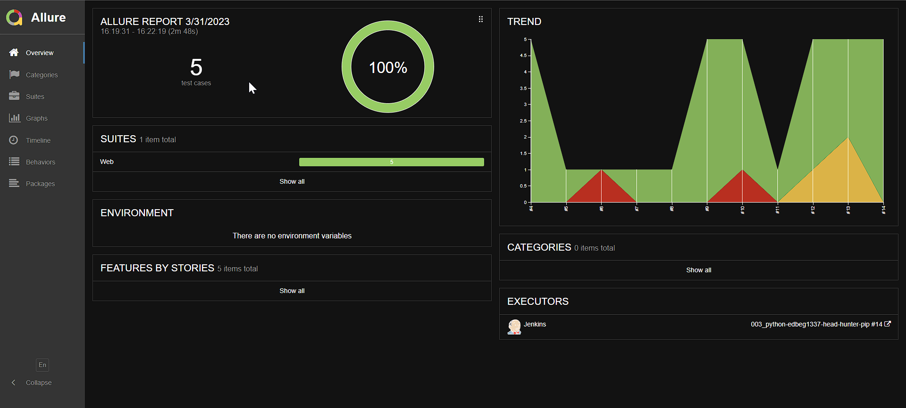

##### Во вкладке Graphs можно посмотреть графики о прохождении тестов, по их приоритезации, по времени прохождения и др.
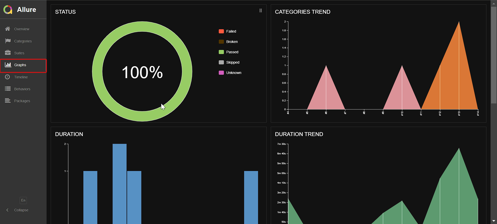

##### Во вкладке Suites находятся собранные тест кейсы, у которых описаны шаги и приложены логи, скриншот и видео о прохождении теста
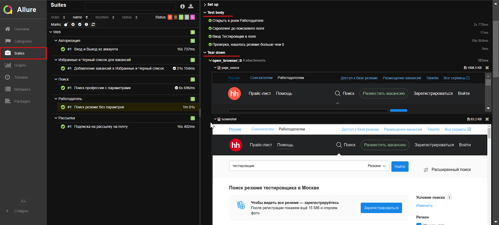

##### Видео прохождение теста
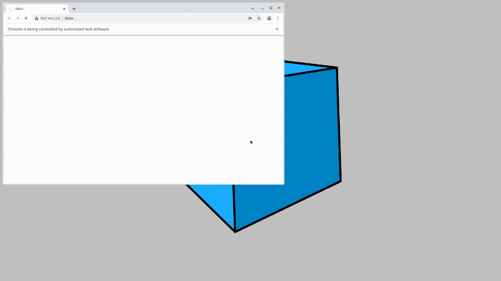

<!-- Allure TestOps -->

###  Интеграция с Allure TestOps

### [Dashboard](https://allure.autotests.cloud/project/2012/dashboards)

##### Так же вся отчетность сохраняется в Allure TestOps, где строятся аналогичные графики.
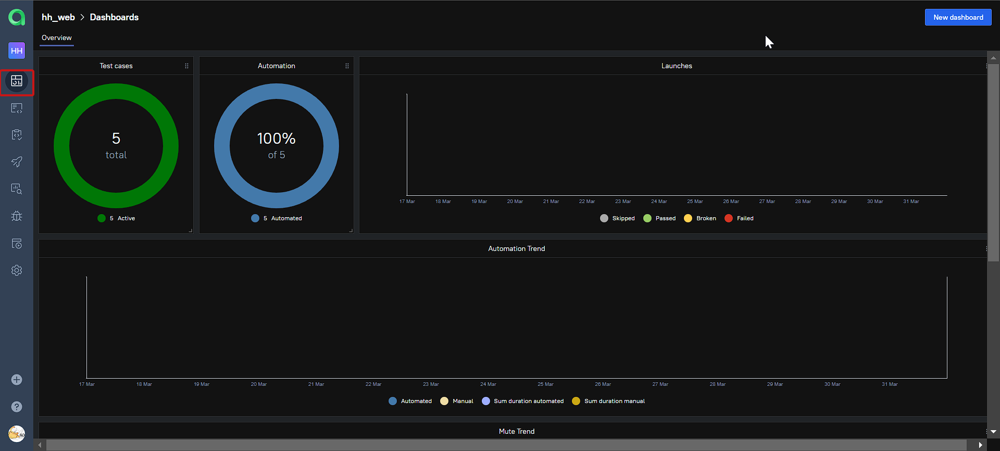

#### Во вкладке со сьютами, мы можем:
- Управлять всеми тест-кейсами или с каждым отдельно
- Перезапускать каждый тест отдельно от всех тестов
- Настроить интеграцию с Jira
- Добавлять ручные тесты и т.д

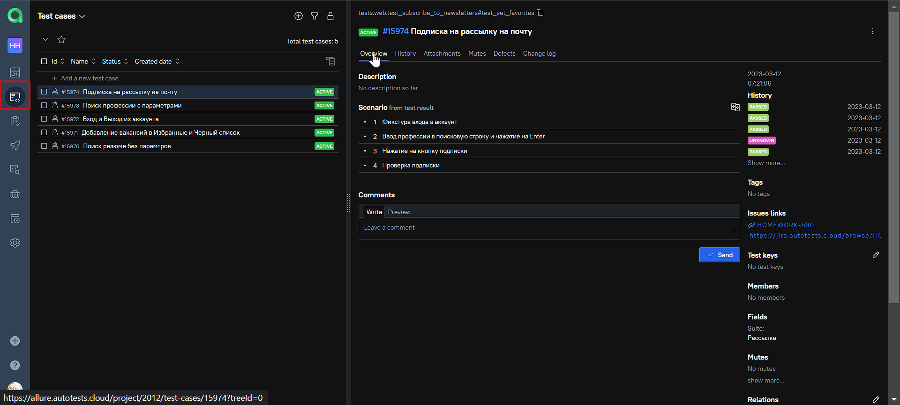

<!-- Jira -->

###  Интеграция с Jira
##### Настроив через Allure TestOps интеграцию с Jira, в тикет можно пробросить результат прохождение тестов и список тест-кейсов из Allure

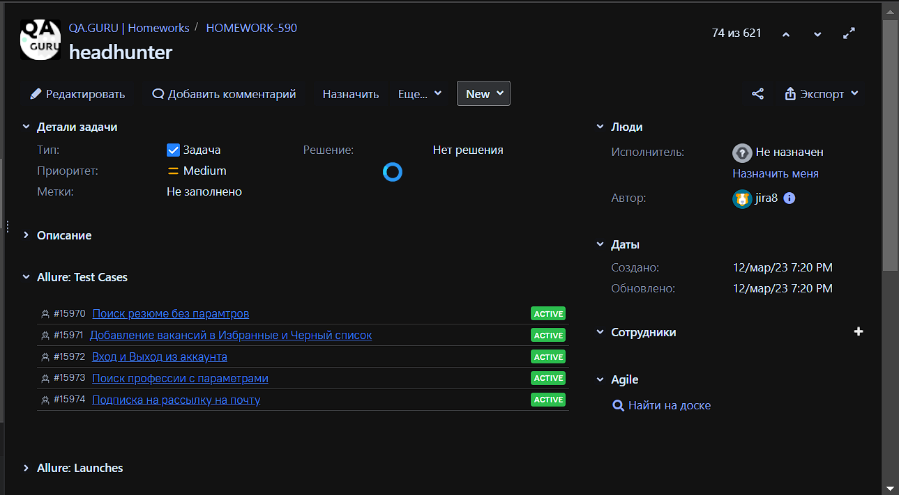

<!-- Telegram -->

###  Интеграция с Telegram
##### После прохождения тестов, в Telegram bot приходит сообщение с графиком и небольшой информацией о тестах.

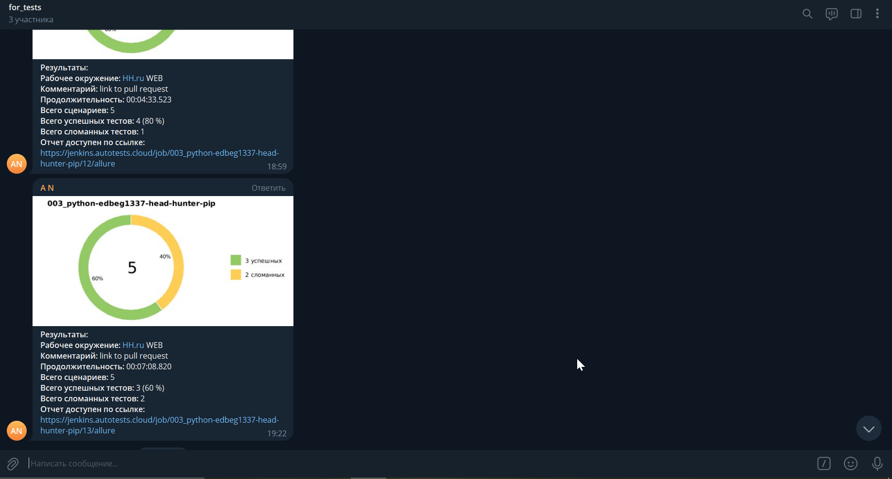
